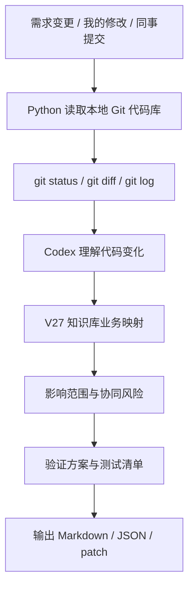
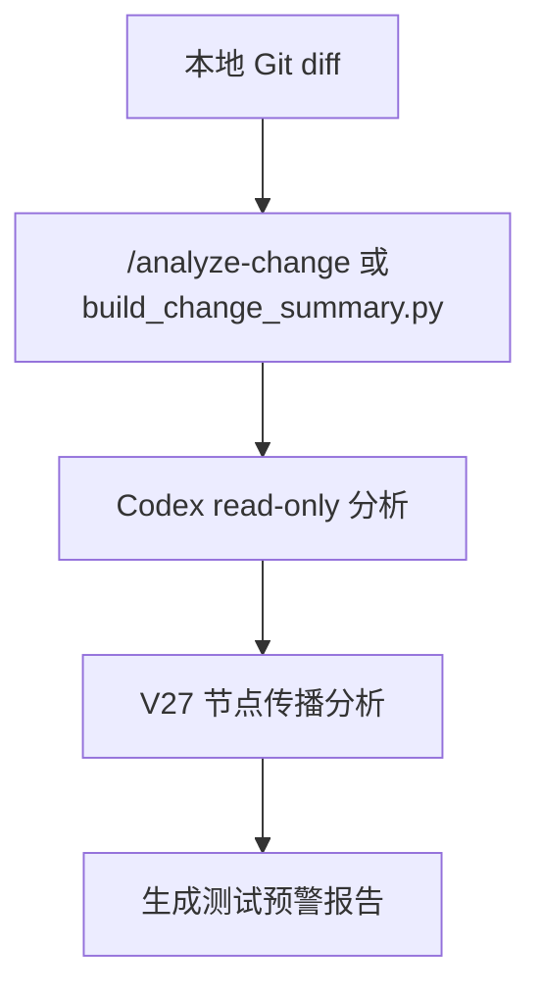
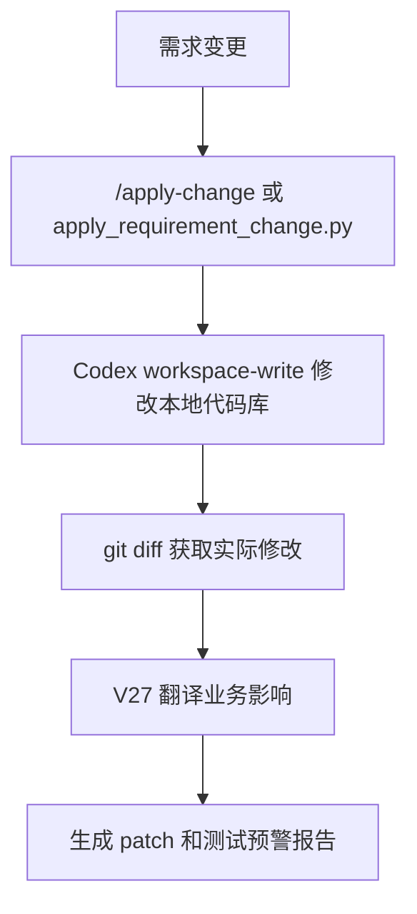

# 流程图

## 总体流程

```mermaid
flowchart TD
    A["需求变更 / 我的修改 / 同事提交"] --> B["Python 读取本地 Git 代码库"]
    B --> C["git status / git diff / git log"]
    C --> D["Codex 理解代码变化"]
    D --> E["V27 知识库业务映射"]
    E --> F["影响范围与协同风险"]
    F --> G["验证方案与测试清单"]
    G --> H["输出 Markdown / JSON / patch"]
```

## 只分析模式

```mermaid
flowchart TD
    A["本地 Git diff"] --> B["/analyze-change 或 build_change_summary.py"]
    B --> C["Codex read-only 分析"]
    C --> D["V27 节点传播分析"]
    D --> E["生成测试预警报告"]
```

## 修改代码模式

```mermaid
flowchart TD
    A["需求变更"] --> B["/apply-change 或 apply_requirement_change.py"]
    B --> C["Codex workspace-write 修改本地代码库"]
    C --> D["git diff 获取实际修改"]
    D --> E["V27 翻译业务影响"]
    E --> F["生成 patch 和测试预警报告"]
```
